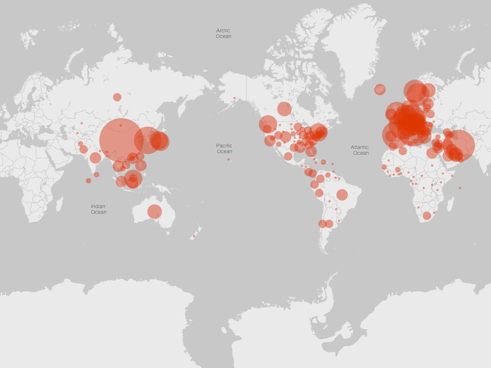

# Covid-19
Analysis of the spread of Covid-19 and forecasting .

Coronavirus disease (COVID-19) is an infectious disease caused by a new virus.The disease causes respiratory illness (like the flu) with symptoms such as a cough, fever, and in more severe cases, difficulty breathing. 
The disease began in Wuhan China in November last year byt now has engulfed the entire world in it's danger.

The epicenter has now shifted to the United States which has reported the modt deaths in the world.
The following notebook performs EDA on the corna dataset taken from kaggle competition and the worldometre website and then also predicts the future number of cases in each effected country via pipeline regression and ARIMA time series analysis.